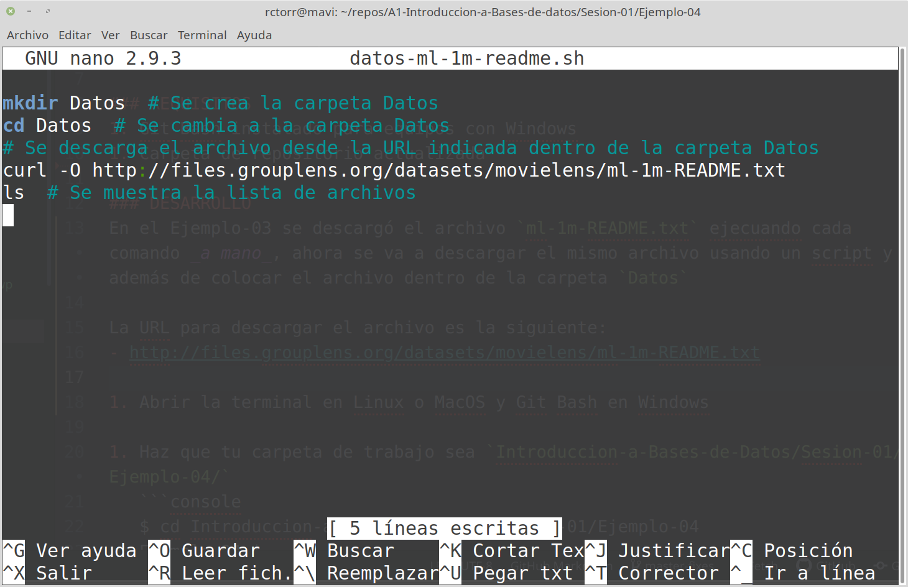

[`Fundamentos de Base de Datos`](../../Readme.md) > [`Sesión 01`](../Readme.md) > Ejemplo-04
## Automatización de tareas con scripts

### OBJETIVOS
- Automatizar tareas con la creación de scripts
- Hacer uso de editores en la terminal

### REQUISITOS
1. Git Bash instalado para equipos con Windows
1. Carpeta de repositorio actualizada

### DESARROLLO
En el Ejemplo-03 se descargó el archivo `ml-1m-README.txt` ejecuando cada comando _a mano_, ahora se va a descargar el mismo archivo usando un script y además de colocar el archivo dentro de la carpeta `Datos`

La URL para descargar el archivo es la siguiente:
- http://files.grouplens.org/datasets/movielens/ml-1m-README.txt

1. Abrir la terminal en Linux o MacOS y Git Bash en Windows

1. Haz que tu carpeta de trabajo sea `Introduccion-a-Bases-de-Datos/Sesion-01/Ejemplo-04/`
   ```console
   $ cd Introduccion-a-Bases-de-Datos/Sesion-01/Ejemplo-04
   Ejemplo-04 $
   ```

1. Se creará el archivo o script `datos-ml-1m-readme.sh` usando el editor para terminal llamado `nano nombre-de-archivo`
   ```console
   Ejemplo-04 $ nano datos-ml-1m-readme.sh
   ```
   Este comando abre el editor `nano` y ahora procedemos a agregar cada comando necesario para crear la carpeta `Datos` y descargar el archivo, colocando un comando por línea, resultando algo similar a lo siguiente:
   

   Para __guardar__ el contenido se presionan las teclas `Control+O` lo que mostrará el nombre del archivo a guardar y si no hay cambio alguno se presiona `Enter` y el archivo estará guardado.

   Para __salir__ del editor se presionan las teclas `Control+X`.

1. Para ejecutar el script se hace uso del comando `bash nombre-de-script`
   ```console
   Ejemplo-04 $ bash datos-ml-1m-readme.sh
     % Total    % Received % Xferd  Average Speed   Time    Time     Time  Current
                                    Dload  Upload   Total   Spent    Left  Speed
   100 5778k  100 5778k    0     0   134k      0  0:00:43  0:00:43 --:--:--  166k
   ml-1m-README.txt
   Ejemplo-04 $
   ```
   El script debería de mostrar mensajes similares a los mostrados arriba sin aparecer mensajes de error, en todo caso para verificar que el script se ejecutó correctamente se debería de contar con una nueva carpeta `Datos` con el archivo descargado en su interior:
   ```
   Datos/
   └── ml-1m-README.txt
   ```

__Misión cumplida__
