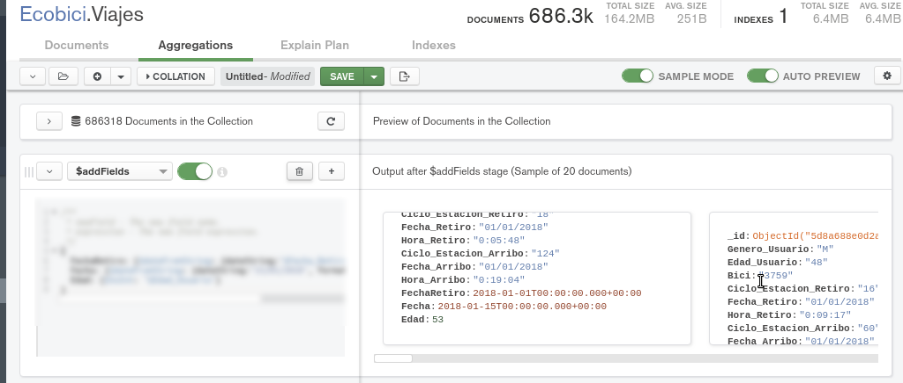
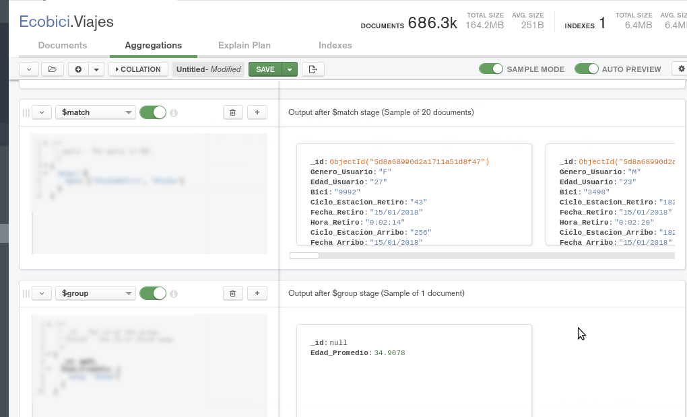

[`Fundamentos de Base de Datos`](../../Readme.md) > [`Sesión 06`](../Readme.md) > Proyecto
## Calculando datos con MongoDB

### OBJETIVO
- Que el alumno realice consultas con resultados calculados

### REQUISITOS
1. Repositorio actualizado
1. Usar la carpeta de trabajo `Sesion-06/Proyecto`
1. Contar con la base de datos __Ecobici__ y la colección __Viajes__

### DESARROLLO
1. Encontrar cuantos viajes se realizaron y cuál es la edad promedio de los ciclistas en la primera mitad de octubre 2019.

   La primera etapa es para agregar todas nuestras variables auxiliares como son __Edad__ (Edad_Usuario en tipo entero), __FechaRetiro__ (Fecha_Retiro en tipo fecha) y __Fecha__ (La constante "01/10/2019" en tipo fecha)
   ```json
   ???
   ```
   Para ver una lista de las operaciones disponibles [ver aquí](https://docs.mongodb.com/manual/reference/operator/aggregation/)

   El resultado es como el siguiente:
   

   La segunda etapa es para obtener todos los ciclistas de la segunda mitad de enero 2018 haciendo uso de __$match__, __$expr__ y __$gte__:
   ```json
   {
     $expr: {
       ???
     }
   }
   ```

   La etapa final es para obtener la edad promedio de los ciclistas haciendo uso de __$group__ y __$avg__:
   ```json
   {
     _id: null,
     Edad_Promedio: {
       ???
     }
   }
   ```

   El resultado final será:
   

1. Obtener el porcentaje de ciclistas mujeres que usaron el servicio el 3 de octubre del 2019.

   La primera etapa es reducir los ciclistas al 3 de octubre del 2019 usando __$match__:
   ```json
   {
     ???
   }
   ```
   

   La segunda etapa se obtiene el total de ciclistas y se crean variables auxiliares para las siguientes etapas usando __$group__, __$sum__ y __$push__:
   ```json
   {
     _id: null,
     ciclistas: {
       ???
     },
     viajes: {
       $push: {
         ???
       }
     }
   }
   ```
   

   En la tercera etapa se emparejan los campos __id__ y __ciclistas__ a lo largo de todo el arreglo __viajes__ usando __$unwind__:
   ```json
   {
     path: "$viajes"
   }
   ```
   

   Con esto cada elemento de nuestra colección tendrá 3 campos, __id__, __ciclistas__ y __viajes.genero__.

   En la cuarta etapa con __$project__ se crea el campo __genero__ para usarlo en la quinta etapa con __$match__ para obtener todos los documentos con genero femenino:

   Para el __$project__:
   ```json
   {
     ???
   }
   ```
   

   Para el __$match__:
   ```json
   {
     ???
   }
   ```
   

   En la sexta etapa se cuentan cuantos documentos quedaron dando lugar a la creación del campo __cifem__ que es el número de ciclistas femeninos y además se agrega el campo __ciclistas__ haciendo uso de cualquier operación que regrese el valor del campo, por ejemplo usando __$min__.
   ```json
   {
     _id: null,
     ciclistas: {
       ???
     },
     cifem: {
       ???
     }
   }
   ```
   

   Con esto se obtiene un sólo documento con dos campos.

   En la última etapa, sólo resta calcular el porcentaje haciendo uso de __$project__ para crear un nuevo campo llamado __porcentaje__:
   ```json
   {
     porcentaje: {
       ???
     }
   }
   ```
   

   Y con esto se obtiene el porcentaje de ciclistas femeninos el 3 de octubre del 2019.
