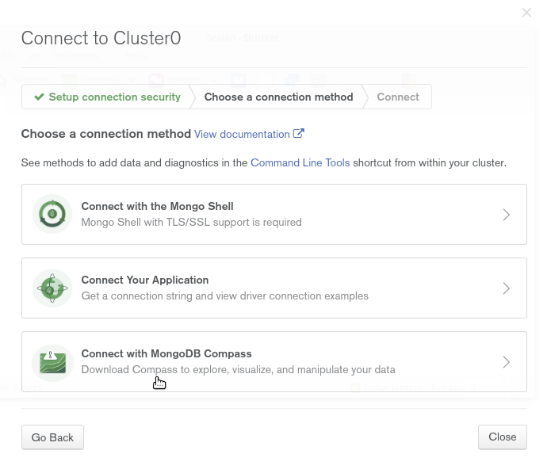
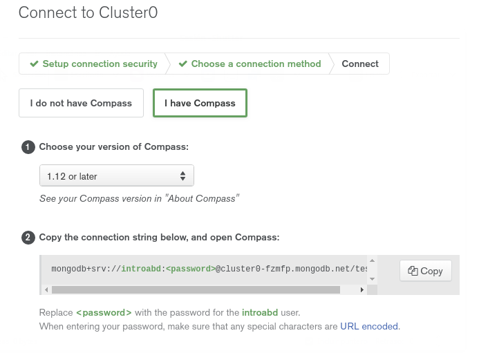
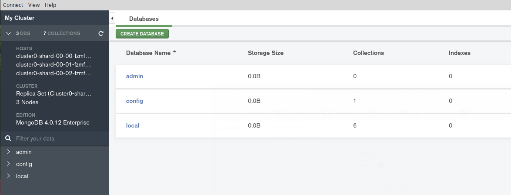

[`Fundamentos de Base de Datos`](../../Readme.md) > [`Sesión 07`](../Readme.md) > Ejemplo-03
## Conexión a MongoDB en la nube

### OBJETIVO
- Que el alumno realice una conexión a un Cluster de MongoDB en la nube

### REQUISITOS
1. Repositorio actualizado
1. Usar la carpeta de trabajo `Sesion-07/Ejemplo-03`
1. MongoDB Compass Instalado
1. Ejemplo 02 realizado

### DESARROLLO
1. Una vez creada la configuración en __MongoDB Atlas__ se realiza la conexión por medio de __MongoDB Compass__, así que estándo en la página de MongoDB Atlas se da click en la opción __Connect with MongoDB Compass__

   

   Después de dar click, se elige la opción donde ya tenemos __Compass__ instalado dando click en __I have Compass__.

   
   En el punto 1 la opción actual es la correcta y en el punto 2 se dá click en el botón __Copy__

1. Si __MongoDB Compass__ está abierto es necesario cerrarlo y abrirlo nuevamente, al momento de iniciar, __Compass__ detecta la información copiada al portapapeles y pregunta si se desea usar la información para realizar la conexión:

   
   Dar click en el botón __Yes__ y __Compass__ en automático llena todos los campos de conexión, menos la clave, así que se teclea la clave y se da click en el botón __CONNECT__.

   
   Recuerda que los datos de conexión son:
   - Usuario: introabd
   - Clave: introabd1234

   __Nota:__ No usar este usuario para colocar información sensible.

   
   En este punto ya __Compass__ ya estará conectado al __Cluster0__ que como se puede ver en la columna izquierda consta de 3 instancias de MongoDB corriendo en paralelo lo que se puede escalar según las necesidades.
   
